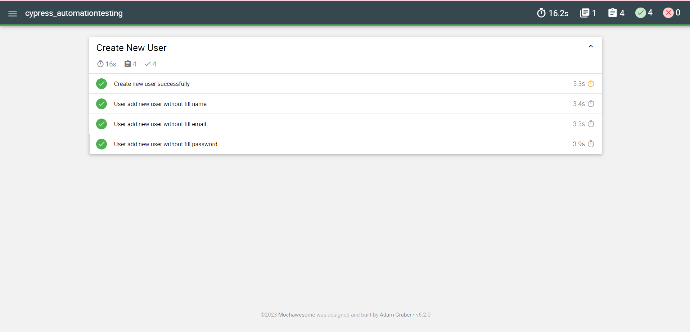

# Cypress UI Automation

## Introduction
This repository was created to test UI of 
[KasirAja](https://kasirdemo.belajarqa.com/) web.
<br/> Technologies used:
<br/> [npm](https://www.npmjs.com/)
<br/> [Cypress](https://www.npmjs.com/package/cypress)
<br/> [Nodejs](https://docs.npmjs.com/downloading-and-installing-node-js-and-npm)
<br/> [Mochawesome](https://www.npmjs.com/package/mochawesome)

## Test Case and Test Scenario
You can see the details of the test scenarios [here](https://docs.google.com/spreadsheets/d/1wAXiueSYq84DZX7H31OlkchtfaIaNKk9h9cRqQwf0Uw/edit?usp=sharing)

## Setup
### Pre-requisites
- Download and install Node.js
- Download and install any Text Editor like Visual Code
- Initilize the project with default settings npm init
- Install dependencies npm install cypress

### Setup Git Repository
- Clone the repository into a folder https://github.com/sofiaa53/cypress_automationtesting.git
- Go to Project root directory and install Dependency: npm install
- All the dependencies from package.json would be installed in node_modules folder.

## Run via CLI
- Clone the project
- Open terminal
- Traverse to the project directory
- Open suite folder ```$ cd spec/suite```
- Run suite ```$ npx cypress run```
- Execution Example [Click Here](https://drive.google.com/file/d/1FdhqDv5jPL2451rOEuV_1Rp1G3QSZKzU/view?usp=sharing)

## Run via Browser
- Clone the project
- Open terminal
- Traverse to the project directory
- Open suite folder ```$ cd spec/suite```
- Run suite ```$ npx cypress open```
- Choose "E2E Testing"
- Choose the browser
- Tap on the scenario


# Reporter
The project uses reporter from [Mochawesome](https://www.npmjs.com/package/mochawesome)
- Install mochawesome <br>```$ npm install mochawesome```
- Tell mocha to use the Mochawesome reporter: <br>```npx cypress run --reporter mochawesome```
- Report Example 

## Author 
[Sofia Awiliyah](https://www.linkedin.com/in/sofia-awiliyah-365206192/) (QA Engineer, 2023)